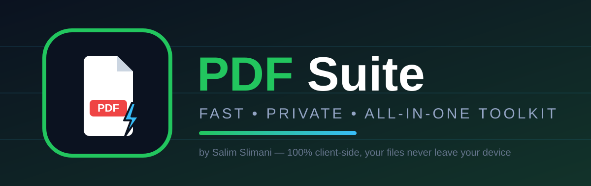
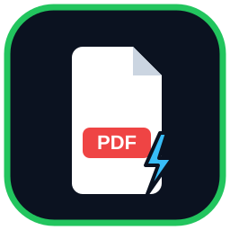

<p align="center">
  
</p>

<p align="center">
  
</p>

<h1 align="center">PDF Suite — Free Online PDF Tools</h1>

<p align="center"><strong>Fast, Private, All-in-One PDF Toolkit.</strong><br/>
Merge, split, compress, convert and edit PDFs — 100% in your browser.</p>

<p align="center">
  
  
  
  
</p>

<p align="center">🌐 <strong>Live demo:</strong> <a href="https://salim-studio.github.io/pdf-suite/">https://salim-studio.github.io/pdf-suite/</a></p>

---

## Why PDF Suite?

- **111 tools** in 6 categories: edit, organize, convert, scan & OCR, compress, secure — **81 work fully in-browser**
- **100% private** — files never leave your device, no account, no uploads
- **Visual PDF editor** (`edit-pdf.html`): add text, images, shapes, drawn signature, plus **OCR that turns scans into editable text**
- **Real conversions**: Word ↔ PDF (real DOCX), Excel ↔ PDF (XLSX/CSV), PDF → PPTX, images ↔ PDF, Markdown/HTML/text → PDF
- **Everyday essentials**: merge, split, extract, delete, rotate, reorder, compress, crop, Filters (grayscale / dark mode / contrast), page numbers, metadata, watermark

## Brand Identity

| Element | Description |
|---|---|
| Name | PDF Suite |
| Tagline | Fast, Private, All-in-One PDF Toolkit |
| Logo | `assets/logo.svg` — white document + red PDF badge + blue speed bolt on deep navy (also used as favicon) |
| Banner | `assets/banner.svg` — 1200×380 social / GitHub preview |
| Hero visual | `assets/hero.svg` — homepage illustration |
| Palette | Navy `#0B1220` • Green `#22C55E` • Sky `#38BDF8` • Red `#EF4444` • Muted `#93A4C4` |
| Language | English by default, Arabic available via in-app toggle |
| Owner | Salim Slimani |

## Quick Start

```bash
# Any static server, e.g.:
python -m http.server 8000
# Then open: http://localhost:8000
```

Or open `index.html` directly in a browser (a local server is recommended so all features work). To publish with GitHub Pages: Settings → Pages → Deploy from a branch → `main` / `/(root)`.

## Project Structure

```
index.html        Home (categories + popular tools + search + hero visual)
tools.html        All 111 tools with search and filters
tool.html         Run any tool (?tool=merge-pdf)
edit-pdf.html     Visual editor (text / images / shapes / signature / OCR)
assets/           logo.svg, banner.svg, hero.svg (brand identity)
css/style.css     Styles + branded header and footer
js/tools-data.js  Tool catalog (111 tools)
js/engine.js      Processing engine (pdf-lib + pdf.js + Tesseract…)
js/icons.js       macOS-style icon system + favicon
js/i18n.js        English / Arabic strings (default: English)
```

## Privacy

All processing happens locally in your browser. The only exception: translation text is sent to the free MyMemory service.

## License

MIT — Copyright © 2026 salim-slimani. All rights reserved.
